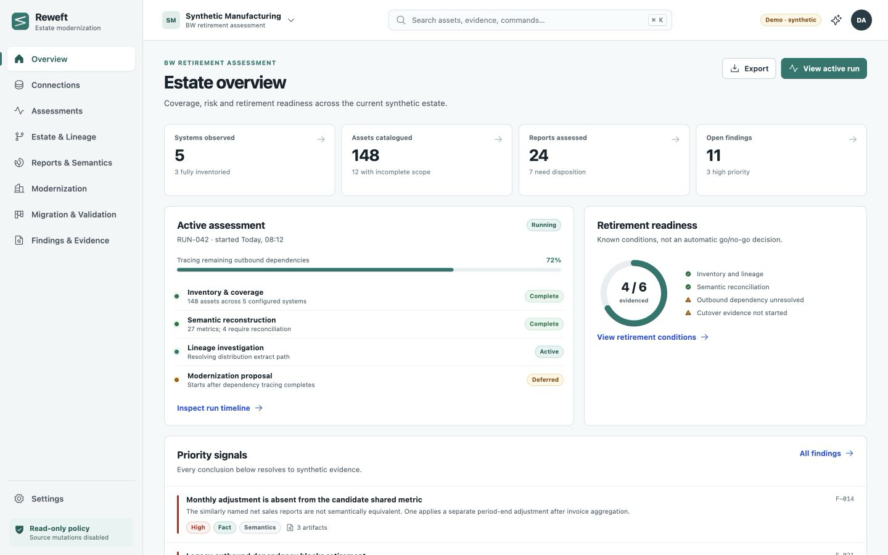

# Reweft

**Understand your estate. Design what comes next.**

Reweft is an open-source, self-hosted application for evidence-backed data-estate assessment and modernization planning. It is designed around read-only evidence collection, explicit uncertainty, cross-system lineage, report rationalization, and versioned target specifications. SAP BW retirement is a specialization, not a prerequisite.

> **Development status:** pre-release. The repository is under active construction. Do not infer live connector certification or production readiness from an adapter, manifest, fixture, or passing unit test. See [BUILD_STATUS.md](BUILD_STATUS.md) and [contracts/acceptance.yaml](contracts/acceptance.yaml).

Public repository: [github.com/dlamaro96/reweft](https://github.com/dlamaro96/reweft) · Documentation: [dlamaro96.github.io/reweft](https://dlamaro96.github.io/reweft/)

## Quick start

The current synthetic UI/API path requires Docker Engine with Compose v2:

```bash
./scripts/bootstrap.sh --demo
```

The launcher preserves existing configuration and data. It prints the URL only after the health endpoint responds. The demo is synthetic, never contacts SAP or an inference provider, and is visibly labeled in the product.

For development commands, run `make help`. See [docs/getting-started/configuration.md](docs/getting-started/configuration.md) for configuration rules and [docs/product-spec.md](docs/product-spec.md) for scope.

Run the durable local integration profile with:

```bash
./scripts/bootstrap-real-runtime.sh
```

It starts at `http://127.0.0.1:8180` with PostgreSQL, Temporal, role-separated workers, a least-privileged synthetic source database, and a labeled deterministic provider. See [docs/operations/real-runtime.md](docs/operations/real-runtime.md); this profile is an integration checkpoint, not live SAP, real-model, HA, or production validation.

## Synthetic demo



The screenshot is generated only from the bundled synthetic manufacturing estate. It is not a customer environment, live SAP validation, or a published benchmark. A smaller-viewport inspection of the connections workspace is retained at [docs/assets/screenshots/connections-mobile.png](docs/assets/screenshots/connections-mobile.png).

## Safety model

- Sources are read-only in assessment mode; arbitrary production queries and source mutation are not product capabilities.
- Every source action—including connection tests, discovery, profiling, retries, and remote collection—must pass the shared workload controller.
- Source credentials are available only to the collector boundary and never to model providers or generated code.
- Missing evidence remains a visible gap. An incomplete scan is not deletion evidence, and no observed use is not proof of disuse.
- Collected facts, deterministic derivations, AI interpretation, generated artifacts, fixture tests, and live validation have distinct states.
- A provider fallback cannot broaden data-egress policy. No fallback is implicit.

## Architecture

The application is a modular monolith deployed as role-specific processes: gateway/UI, API, orchestration-analysis worker, inference worker, collector worker, PostgreSQL, and Temporal. The default Compose path remains the isolated demo on SQLite. The opt-in `real-runtime` profile runs the durable PostgreSQL/Temporal path with internal services unpublished and source/provider egress separated by worker role. The compact topology is single-node and not highly available.

## Capabilities

The machine-readable connector and target records under `contracts/` are authoritative for what is implemented and validated. A visible connector must not claim more than those records. Synthetic artifact support is not live-system certification.

## License and participation

Original project code and documentation are licensed under Apache-2.0. Contributions use a Developer Certificate of Origin sign-off; see [CONTRIBUTING.md](CONTRIBUTING.md), [SECURITY.md](SECURITY.md), and [GOVERNANCE.md](GOVERNANCE.md).
